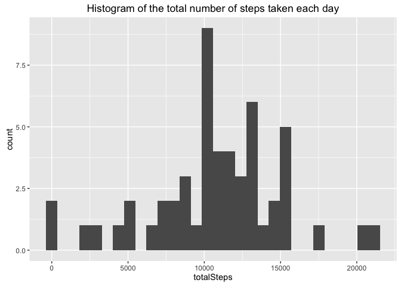
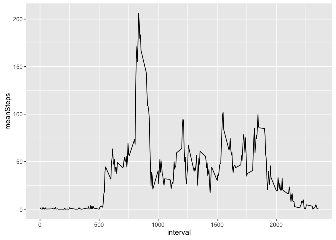
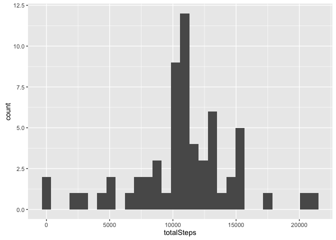
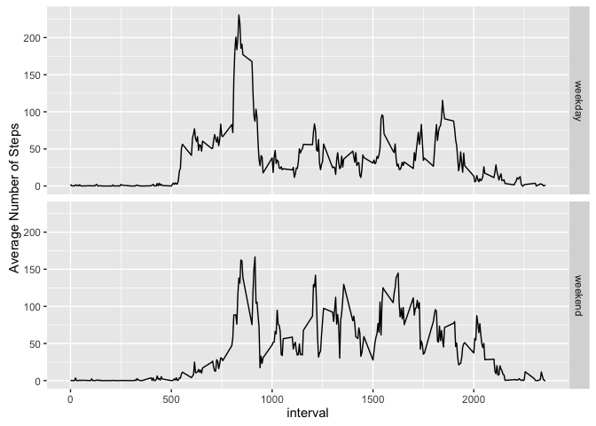

# Reproducible Research: Peer Assessment 1


## Loading and preprocessing the data


```r
library(dplyr)
library(ggplot2)

unzip("activity.zip")
d <- read.csv("activity.csv", header=TRUE, na.strings = "NA")
d$date <- as.Date(d$date)
```


## What is mean total number of steps taken per day?
First, We will group the data frame by date.

```r
# group by date
dGroupedByDate <- group_by(d, date)
# calculate mean, median, and totalsteps using the summarise function
dSummary<- summarise(dGroupedByDate, meanSteps=mean(steps), medianSteps=median(steps, na.rm=TRUE),  totalSteps=sum(steps))
```


**Histogram of the total number of steps taken each day**
let's plot the data to see the total number of steps taken each day

```r
qplot(totalSteps, data=dSummary,geom="histogram", main="Histogram of the total number of steps taken each day")
```

<!-- -->

**Mean and median total number of steps taken per day:**

```r
print(dSummary, n=nrow(dSummary))
```

```
## # A tibble: 61 <U+00D7> 4
##          date  meanSteps medianSteps totalSteps
##        <date>      <dbl>       <dbl>      <int>
## 1  2012-10-01         NA          NA         NA
## 2  2012-10-02  0.4375000           0        126
## 3  2012-10-03 39.4166667           0      11352
## 4  2012-10-04 42.0694444           0      12116
## 5  2012-10-05 46.1597222           0      13294
## 6  2012-10-06 53.5416667           0      15420
## 7  2012-10-07 38.2465278           0      11015
## 8  2012-10-08         NA          NA         NA
## 9  2012-10-09 44.4826389           0      12811
## 10 2012-10-10 34.3750000           0       9900
## 11 2012-10-11 35.7777778           0      10304
## 12 2012-10-12 60.3541667           0      17382
## 13 2012-10-13 43.1458333           0      12426
## 14 2012-10-14 52.4236111           0      15098
## 15 2012-10-15 35.2048611           0      10139
## 16 2012-10-16 52.3750000           0      15084
## 17 2012-10-17 46.7083333           0      13452
## 18 2012-10-18 34.9166667           0      10056
## 19 2012-10-19 41.0729167           0      11829
## 20 2012-10-20 36.0937500           0      10395
## 21 2012-10-21 30.6284722           0       8821
## 22 2012-10-22 46.7361111           0      13460
## 23 2012-10-23 30.9652778           0       8918
## 24 2012-10-24 29.0104167           0       8355
## 25 2012-10-25  8.6527778           0       2492
## 26 2012-10-26 23.5347222           0       6778
## 27 2012-10-27 35.1354167           0      10119
## 28 2012-10-28 39.7847222           0      11458
## 29 2012-10-29 17.4236111           0       5018
## 30 2012-10-30 34.0937500           0       9819
## 31 2012-10-31 53.5208333           0      15414
## 32 2012-11-01         NA          NA         NA
## 33 2012-11-02 36.8055556           0      10600
## 34 2012-11-03 36.7048611           0      10571
## 35 2012-11-04         NA          NA         NA
## 36 2012-11-05 36.2465278           0      10439
## 37 2012-11-06 28.9375000           0       8334
## 38 2012-11-07 44.7326389           0      12883
## 39 2012-11-08 11.1770833           0       3219
## 40 2012-11-09         NA          NA         NA
## 41 2012-11-10         NA          NA         NA
## 42 2012-11-11 43.7777778           0      12608
## 43 2012-11-12 37.3784722           0      10765
## 44 2012-11-13 25.4722222           0       7336
## 45 2012-11-14         NA          NA         NA
## 46 2012-11-15  0.1423611           0         41
## 47 2012-11-16 18.8923611           0       5441
## 48 2012-11-17 49.7881944           0      14339
## 49 2012-11-18 52.4652778           0      15110
## 50 2012-11-19 30.6979167           0       8841
## 51 2012-11-20 15.5277778           0       4472
## 52 2012-11-21 44.3993056           0      12787
## 53 2012-11-22 70.9270833           0      20427
## 54 2012-11-23 73.5902778           0      21194
## 55 2012-11-24 50.2708333           0      14478
## 56 2012-11-25 41.0902778           0      11834
## 57 2012-11-26 38.7569444           0      11162
## 58 2012-11-27 47.3819444           0      13646
## 59 2012-11-28 35.3576389           0      10183
## 60 2012-11-29 24.4687500           0       7047
## 61 2012-11-30         NA          NA         NA
```


## What is the average daily activity pattern?
First, we need to group the observations by time intervals accross all days. then, calaculate the mean of steps per each interval.

```r
dGroupedByInterval <- group_by(d, interval)
dSummaryInterval<- summarise(dGroupedByInterval, meanSteps=mean(steps, na.rm=TRUE))

qplot(interval, meanSteps, data=dSummaryInterval,geom="line")
```

<!-- -->

```r
dSummaryInterval<- arrange(dSummaryInterval, desc(meanSteps)) # sort descending by mean Steps
intervalWithMaxSteps <- dSummaryInterval[1,1] 
```
**The 5 min interval with max average steps is: 835**

## Imputing missing values
**Total number of missing values in the dataset (i.e. the total number of rows with NAs)**

```r
NAStepsCount <- summarise(d, NAcount=sum(is.na(steps)), total.count=n())
percentageOfNA <- (NAStepsCount$NAcount[1]/NAStepsCount$total.count[1])*100
```
**Total number of NA: 2304**

Percentage of NA among observations: 13.1147541 %

**Strategy to Fill NA enteries**
We can fill the NA enteries with the averages of their corresponding 5-min intervals accross all the days. If the avergae is not avaiable (i.e. incase this interval had no observation recorded accross all days, we will set it to zero)

```r
# Copying original dataset to a new data frame before replacing the NAs
dEstimated <- d
# creating a lookup list for the average of each interval
# note the interval will be a chanracter index for the generated array
intervalMean <-tapply(d$steps, d$interval,mean, na.rm=TRUE)
#loop on all rows with NA enteries and replace it with the interval average
for (i in which(is.na(dEstimated)))
  {
  avgSteps <- intervalMean[as.character(dEstimated[i,3])]
  dEstimated[i,1] <- ifelse(is.na(avgSteps), 0, avgSteps)
  }
```

**Histogram of the total number of steps taken each day (after replacing NAs with average steps of same intervals)**

```r
dEstimatedGroupedByDate <- group_by(dEstimated, date)
dEstimatedSummary<- summarise(dEstimatedGroupedByDate, meanSteps=mean(steps), medianSteps=median(steps, na.rm=TRUE),  totalSteps=sum(steps))
qplot(totalSteps, data=dEstimatedSummary,geom="histogram")
```

<!-- -->


**Mean and median total number of steps taken per dayay (after replacing NAs with average):**

```r
print(dEstimatedSummary, n=nrow(dEstimatedSummary))
```

```
## # A tibble: 61 <U+00D7> 4
##          date  meanSteps medianSteps totalSteps
##        <date>      <dbl>       <dbl>      <dbl>
## 1  2012-10-01 37.3825996    34.11321   10766.19
## 2  2012-10-02  0.4375000     0.00000     126.00
## 3  2012-10-03 39.4166667     0.00000   11352.00
## 4  2012-10-04 42.0694444     0.00000   12116.00
## 5  2012-10-05 46.1597222     0.00000   13294.00
## 6  2012-10-06 53.5416667     0.00000   15420.00
## 7  2012-10-07 38.2465278     0.00000   11015.00
## 8  2012-10-08 37.3825996    34.11321   10766.19
## 9  2012-10-09 44.4826389     0.00000   12811.00
## 10 2012-10-10 34.3750000     0.00000    9900.00
## 11 2012-10-11 35.7777778     0.00000   10304.00
## 12 2012-10-12 60.3541667     0.00000   17382.00
## 13 2012-10-13 43.1458333     0.00000   12426.00
## 14 2012-10-14 52.4236111     0.00000   15098.00
## 15 2012-10-15 35.2048611     0.00000   10139.00
## 16 2012-10-16 52.3750000     0.00000   15084.00
## 17 2012-10-17 46.7083333     0.00000   13452.00
## 18 2012-10-18 34.9166667     0.00000   10056.00
## 19 2012-10-19 41.0729167     0.00000   11829.00
## 20 2012-10-20 36.0937500     0.00000   10395.00
## 21 2012-10-21 30.6284722     0.00000    8821.00
## 22 2012-10-22 46.7361111     0.00000   13460.00
## 23 2012-10-23 30.9652778     0.00000    8918.00
## 24 2012-10-24 29.0104167     0.00000    8355.00
## 25 2012-10-25  8.6527778     0.00000    2492.00
## 26 2012-10-26 23.5347222     0.00000    6778.00
## 27 2012-10-27 35.1354167     0.00000   10119.00
## 28 2012-10-28 39.7847222     0.00000   11458.00
## 29 2012-10-29 17.4236111     0.00000    5018.00
## 30 2012-10-30 34.0937500     0.00000    9819.00
## 31 2012-10-31 53.5208333     0.00000   15414.00
## 32 2012-11-01 37.3825996    34.11321   10766.19
## 33 2012-11-02 36.8055556     0.00000   10600.00
## 34 2012-11-03 36.7048611     0.00000   10571.00
## 35 2012-11-04 37.3825996    34.11321   10766.19
## 36 2012-11-05 36.2465278     0.00000   10439.00
## 37 2012-11-06 28.9375000     0.00000    8334.00
## 38 2012-11-07 44.7326389     0.00000   12883.00
## 39 2012-11-08 11.1770833     0.00000    3219.00
## 40 2012-11-09 37.3825996    34.11321   10766.19
## 41 2012-11-10 37.3825996    34.11321   10766.19
## 42 2012-11-11 43.7777778     0.00000   12608.00
## 43 2012-11-12 37.3784722     0.00000   10765.00
## 44 2012-11-13 25.4722222     0.00000    7336.00
## 45 2012-11-14 37.3825996    34.11321   10766.19
## 46 2012-11-15  0.1423611     0.00000      41.00
## 47 2012-11-16 18.8923611     0.00000    5441.00
## 48 2012-11-17 49.7881944     0.00000   14339.00
## 49 2012-11-18 52.4652778     0.00000   15110.00
## 50 2012-11-19 30.6979167     0.00000    8841.00
## 51 2012-11-20 15.5277778     0.00000    4472.00
## 52 2012-11-21 44.3993056     0.00000   12787.00
## 53 2012-11-22 70.9270833     0.00000   20427.00
## 54 2012-11-23 73.5902778     0.00000   21194.00
## 55 2012-11-24 50.2708333     0.00000   14478.00
## 56 2012-11-25 41.0902778     0.00000   11834.00
## 57 2012-11-26 38.7569444     0.00000   11162.00
## 58 2012-11-27 47.3819444     0.00000   13646.00
## 59 2012-11-28 35.3576389     0.00000   10183.00
## 60 2012-11-29 24.4687500     0.00000    7047.00
## 61 2012-11-30 37.3825996    34.11321   10766.19
```

**Do these values differ from the estimates from the first part of the assignment?**
let's have a quick look on the summary of the original and imputed table

```r
summary(dSummary)
```

```
##       date              meanSteps        medianSteps   totalSteps   
##  Min.   :2012-10-01   Min.   : 0.1424   Min.   :0    Min.   :   41  
##  1st Qu.:2012-10-16   1st Qu.:30.6979   1st Qu.:0    1st Qu.: 8841  
##  Median :2012-10-31   Median :37.3785   Median :0    Median :10765  
##  Mean   :2012-10-31   Mean   :37.3826   Mean   :0    Mean   :10766  
##  3rd Qu.:2012-11-15   3rd Qu.:46.1597   3rd Qu.:0    3rd Qu.:13294  
##  Max.   :2012-11-30   Max.   :73.5903   Max.   :0    Max.   :21194  
##                       NA's   :8         NA's   :8    NA's   :8
```

```r
summary(dEstimatedSummary)
```

```
##       date              meanSteps        medianSteps       totalSteps   
##  Min.   :2012-10-01   Min.   : 0.1424   Min.   : 0.000   Min.   :   41  
##  1st Qu.:2012-10-16   1st Qu.:34.0938   1st Qu.: 0.000   1st Qu.: 9819  
##  Median :2012-10-31   Median :37.3826   Median : 0.000   Median :10766  
##  Mean   :2012-10-31   Mean   :37.3826   Mean   : 4.474   Mean   :10766  
##  3rd Qu.:2012-11-15   3rd Qu.:44.4826   3rd Qu.: 0.000   3rd Qu.:12811  
##  Max.   :2012-11-30   Max.   :73.5903   Max.   :34.113   Max.   :21194
```

```r
colSums(dSummary[,2:4], na.rm = T)
```

```
##   meanSteps medianSteps  totalSteps 
##    1981.278       0.000  570608.000
```

```r
colSums(dEstimatedSummary[,2:4], na.rm = T)
```

```
##   meanSteps medianSteps  totalSteps 
##   2280.3386    272.9057 656737.5094
```
By comparing the data summaries above, the mean, median and average total steps have the following chnages:
- The Total average steps has increased after adding the imputated/estimated data
- The overall mean of steps (for all days) have remained the same, however it has chnaged for the days with imputated/estimates data.
- The median has chnaged for the days with estimated enteries.

**What is the impact of imputing missing data on the estimates of the total daily number of steps?**


```r
originalTotalDays <- summarise(dSummary, total.steps=sum(totalSteps, na.rm = T))
imputedTotalDays <- summarise(dEstimatedSummary, total.steps=sum(totalSteps, na.rm = T))

totDaysDiff <- imputedTotalDays[[1]] -originalTotalDays[[1]]
totDaysDiffPercentage <- (totDaysDiff/originalTotalDays) * 100
```
The imputed days added 8.6129509\times 10^{4} extra steps representing ad addition of 15.0943396 % of the original total steps.


## Are there differences in activity patterns between weekdays and weekends?
Creating a new factor variable (dayType) in the dataset with two levels -- "weekday" and "weekend" indicating whether a given date is a weekday or weekend day


```r
dEstimated$dayType <- ifelse((weekdays(dEstimated$date) %in% c('Sunday','Saturday')), 'weekend', 'weekday')
dEstimated$dayType <- as.factor(dEstimated$dayType)
str(dEstimated)
```

```
## 'data.frame':	17568 obs. of  4 variables:
##  $ steps   : num  1.717 0.3396 0.1321 0.1509 0.0755 ...
##  $ date    : Date, format: "2012-10-01" "2012-10-01" ...
##  $ interval: int  0 5 10 15 20 25 30 35 40 45 ...
##  $ dayType : Factor w/ 2 levels "weekday","weekend": 1 1 1 1 1 1 1 1 1 1 ...
```

a panel plot containing a time series plot (i.e. type = "l") of the 5-minute interval (x-axis) and the average number of steps taken, averaged across all weekday days or weekend days (y-axis). The plot should look something like the following, which was created using simulated data


```r
dGrpByDayTypeInterval <- group_by(dEstimated, dayType, interval)
dSummaryDayTypeInterval<- summarise(dGrpByDayTypeInterval, meanSteps=mean(steps, na.rm=TRUE))
qplot(interval, meanSteps, data=dSummaryDayTypeInterval,geom="line", facets = dayType~., ylab = "Average Number of Steps")
```

<!-- -->


